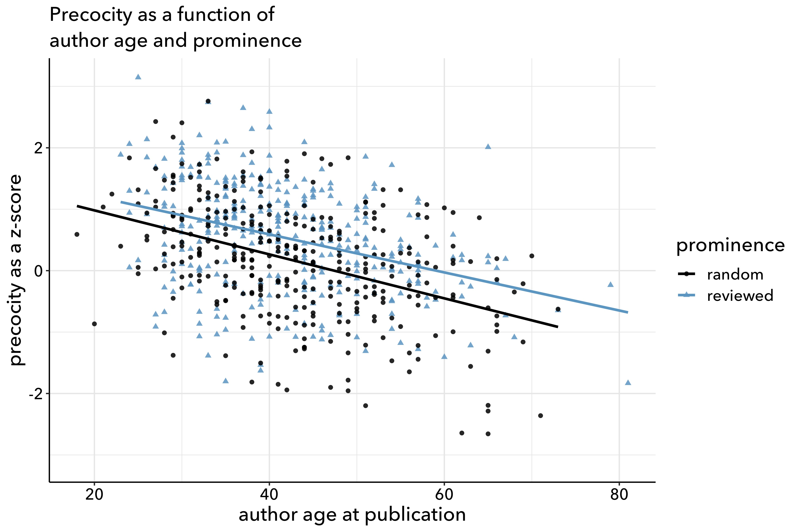

Scripts specifically supporting "Can We Map Culture?"
-----------------------------------------------------

Most of the analysis reported in the article takes place in **mainanalysis.ipynb**.

That in turn builds on results produced by the two Python scripts:

**calculate_supp4_kld.py** and
**kld_calc_worker_supp4.py**

The actual data used and preoduced by these scripts is too big for a GitHub repository, but it has been archived in the institutional repository of UIUC: http://hdl.handle.net/2142/109019

The "doc_topics" file in that data publication is a topic model produced by MALLET. **calculate_supp4_kld.py** carries out comparisons between individual topic vectors, and the results are recorded in the "summary" files in the same data publication. Those summary files are in turn used by **mainanalysis.ipynb**.

The output of **mainanalysis.ipynb** includes the two tab-separated data files in this folder:

**viz_for_effect_size.tsv** and
**precocity_of_reviewed_fiction.tsv**

These data files in turn are used by the R scripts contained here to produce images used in the article, notably this one:

